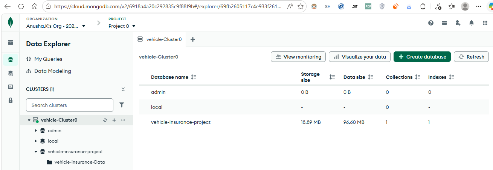
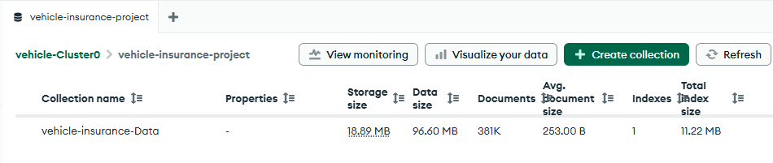
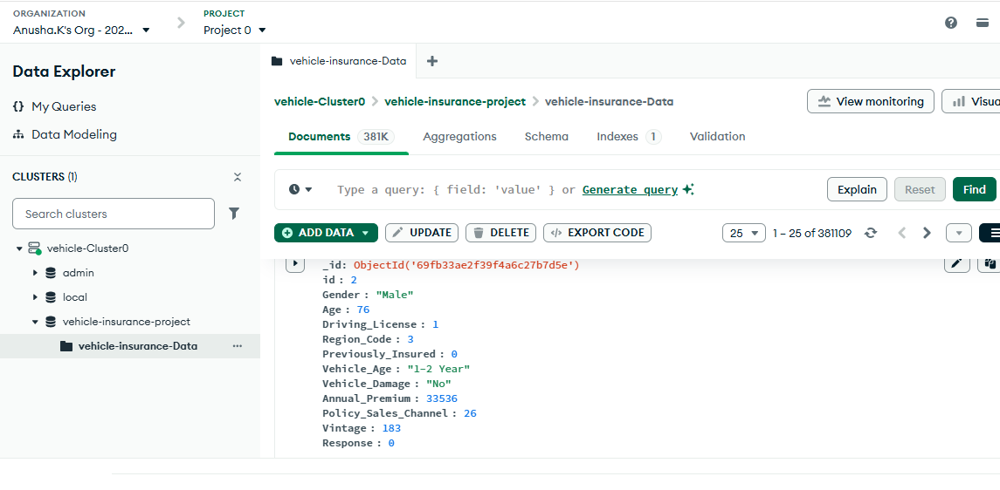

# Project Setup
1. Create project template by executing template.py file
2. Write the code on setup.py and pyproject.toml to import local packages. 
3. Create a virtual env, activate it and install the requirements from requirements.txt 

    i) Create a virtual environment named 'vehicle'
    ```
    python -m venv vehicle
    ```
    ii) Activate the environment (windows - cmd)
    ```
    vehicle\Scripts\activate.bat
    ```
    iii) To deactive the environment 
    ```
    deactivate
    ```
    iii) Add required modules to requirements.txt, by doing
    ```
    pip install -r requirements.txt
    ```
4. Do a "pip list" on terminal to make sure you have local packages installed. 
5. Include -e . in requirements.txt to install all the local packages from src folder in your "vehicle" environment.
6. Create a .env file and add the mongodb connection string.
```
CONNECTION_URL = <mongo-db_connection_string>
```

## MongoDB Setup
1. Sign up to MongoDB Atlas and create a new project by just providing it a name then next next create.
2. From "Create a cluster" screen, hit "create", Select M0 service keeping other services as default, hit "create deployment" (NOTE : We store data inside clusters)
3. Setup the username and password and then create DB user.
4. Go to "network access" and add ip address - "0.0.0.0/0" so that we can access it from anywhere
5. Go back to project >> "Get Connection String" >> "Drivers" >> {Driver:Python, Version:3.12 or later} 
   >> copy and save the connection string with you(replace <db_password>). >> Done.
6. Create folder "notebook" >> do step 7 >>  create file "mongoDB_demo.ipynb" >> select kernel>python kernel>vehicle>>
7. Dataset added to notebook folder
8. Push your data to mongoDB database from your python notebook. We have to upload data in mongodb in key value format. 
9. Go to mongoDB Atlas >> Database >> browse collection >> see your data in key value format

### MongoDB Data Upload Heirarchy: 
Organisation -> Project -> Cluster -> Database -> Collection

1. View Database



2. View Collections 



3. Data Successfully uploaded to MongoDB Atlas Database



## Logger and Exception Module Setup

